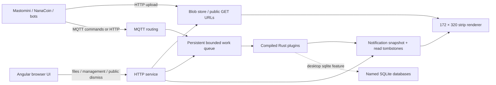

# First single-board architecture

All services share one process and one persisted cloud state in this prototype.
The board does not depend on a desktop broker. HTTP runs in one 32 KiB stack
thread; MQTT, workers, Wi-Fi maintenance and physical rendering run in the main
loop. Desktop uses one HTTP thread and a combined MQTT/worker thread. No Tokio
runtime, per-client threads or whole-file blob buffering are required.

## Persistence and work

Two checksum-protected state slots alternate generations, with fsync before
publishing a new in-memory state. A torn newest slot falls back to the previous
valid generation; if both are invalid, startup refuses to reset the data.
Recovery checks referenced file sizes. Maximum serialized state is 64 KiB;
storage exhaustion is an error, never silent eviction of active notices or
queued work. Completed work receipts and read tombstones have explicit bounded
retention. This is a prototype recovery scheme, not a tested guarantee under
physical ESP32 power cuts. Back up the entire data directory/partition together.

MQTT transport acknowledgment means durable queue acceptance for plugin topics.
Only a `done` receipt means completed work. Screen mutations and their receipt
share a cloud commit. SQL side effects commit separately and use unique event
IDs in SQLite to make retries safe. Future remote/API plugins need a similar
outbox/receipt or idempotency mechanism. This is not global exactly-once delivery.

Compiled plugins can express stored-procedure style sequences, queue-to-insert
workers or device actions. The core provides registration and serial execution;
the plugin owns its domain rules. There is currently one owner per topic, no
worker pool, no scheduled invocation system, no dead-letter replay button and
no module sandbox. A plugin removed from the build leaves its jobs visible as
failed work.

## APIs and trust

| Endpoint | Access / behavior |
|---|---|
| `GET /`, `/screen` | Public Angular kitchen screen |
| `GET /admin` | Angular management shell; token required for management API |
| `GET /api/status` | Public service/limits/heap |
| `GET /api/screen` | Public authoritative notification snapshot |
| `POST /api/screen/next` | Public advance |
| `POST /api/screen/{source}/{id}/dismiss` | Public dismissal; persists read tombstone |
| `POST /api/screen/notify`, `/read` | Public; enqueue screen commands |
| `GET /api/blobs` | Token; file-browser metadata |
| `PUT/DELETE /api/blobs/{bucket}/{key}` | Token; upload/delete |
| `GET/HEAD /blobs/{bucket}/{key}` | Public original file, MIME type, ETag, inline filename |
| `POST /api/publish` | Token; `{topic,payload}` to routing/work |
| `POST /api/plugins/{name}/invoke` | Token; `{topic,payload}` to a specific compiled plugin |
| `GET /api/jobs` | Token; pending work and recent results |
| `POST /api/databases/{name}/query` | Token; optional desktop SQLite transaction |

HTTP is deliberately sequential and closes connections after a response. It
accepts at most 4 KiB of headers and bounds body parsing. A blob upload currently
holds the cloud mutex while streaming; other mutations/work may pause during
the upload. This favors simplicity and bounded memory over throughput. The
first hardware load test must measure this pause and MQTT keepalive under a
slow upload. Large images belong on a future SD card/Pi, not this 3 MiB budget.

Producers use stable `(source,id)` notification identities and distinct,
globally unique event IDs for `notify` and `read`. NanaCoin's browser-local New
markers do not currently create shared read events. A future app integration
must choose its authoritative read state and emit the read command from that
transition. Public kitchen dismissal currently clears the screen only; it
does not mark mail read inside the originating app. Avoid logging private
message contents; screen text should normally be an unread-message summary.

## Splitting across more devices later

Keep the same topics, event IDs and public file paths. Move blob storage and
SQLite first to a Raspberry Pi; keep the C6 as a display/subscriber. Clients
should be configured with explicit service origins rather than discovering
services from board count. A fuller broker can replace this routing layer while
compiled workers continue consuming the same command schema. The durable work
queue must have one authoritative owner; splitting nodes is not accomplished
by copying its data directory or treating pub/sub as a replicated database.

The current screen firmware reads local files. A remote-blob deployment will
need a bounded HTTP strip reader/cache and a screen MQTT client. No transparent
clustering or multi-board failover is implemented. Existing Mastomini bots can
move into plugin modules incrementally, once their timers, HTTP/TLS clients,
credentials and resource use have explicit limits. Independent OTA modules
would need a stable ABI or interpreter plus a revised partition/update design.

## Hardware feasibility evidence

The C6 target cross-compiled with the actual 8 MiB flash configuration and the
existing 2 MiB app partition. GNU `size` includes an artificial flash padding
section in its BSS total; use section-level output instead of treating that as
RAM. The initial ELF had approximately 111,104 bytes of IRAM text, 16,836 bytes
of DRAM data and 23,008 bytes of DRAM BSS. Runtime allocations add Wi-Fi/lwIP,
stacks, SPIFFS state, plugin state/clones, queues and the LCD DMA strip.

These measurements show a build fits flash and linker RAM regions. They do not
prove all services fit peak runtime heap. Start the hardware trial with one
image, one notification and two MQTT clients; record `/api/status` heap minimum
and largest block, then test restarts, reconnects and slow uploads before filling
the configured limits. There is no SD dependency and no SQLite in the C6 build.

## Roadmap

- Add household pairing, producer credentials, notification quotas/rate limits
  and TLS when protection against neighbors becomes a requirement. Public
  notification posting and dismissal are intentional for the first LAN trial.
- Measure the single C6 runtime heap before increasing blob/queue limits.
- Add an SD card or move blob storage and workers to a Pi when available.
- Keep the same notification contract when splitting services across boards.

### First hardware trial (September 30, 2026)

The C6 now runs the prototype at `minicloud.local`. The live notification,
expiry, MQTT and RGB565 upload/render-command trial passed, with 240,568 bytes
initial free heap and a 210,080-byte boot minimum; restart preserved the notice
and its original deadline. [DEPLOY.md](DEPLOY.md) records image hashes, exact
steps, measurements and remaining physical/load-test limitations. This is
small-workload evidence, not a claim that every configured limit fits at once.
